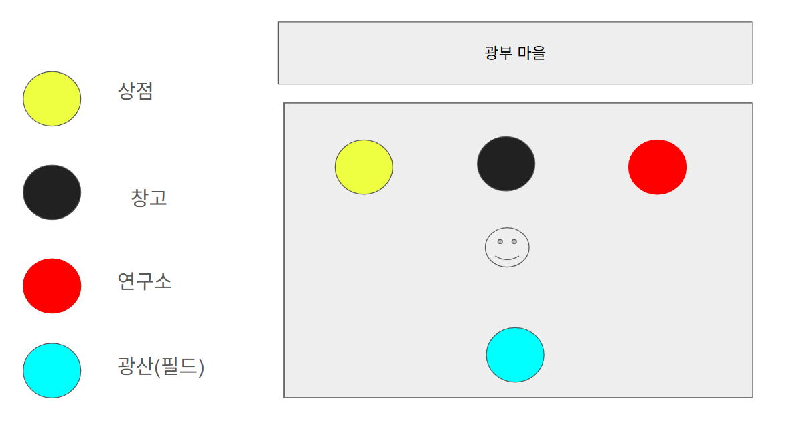
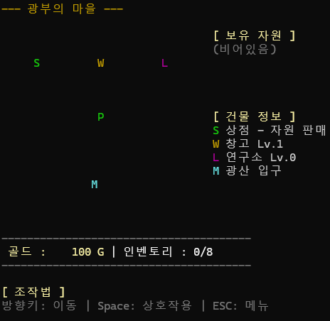
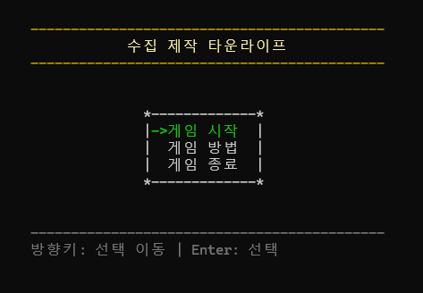
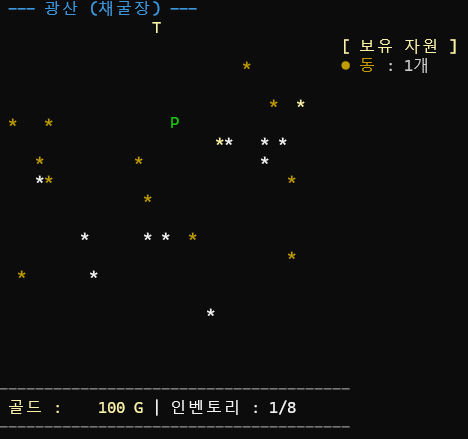
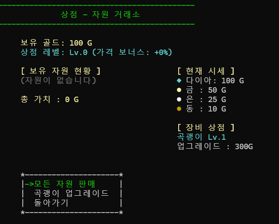
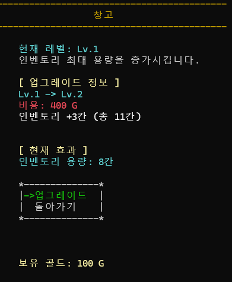
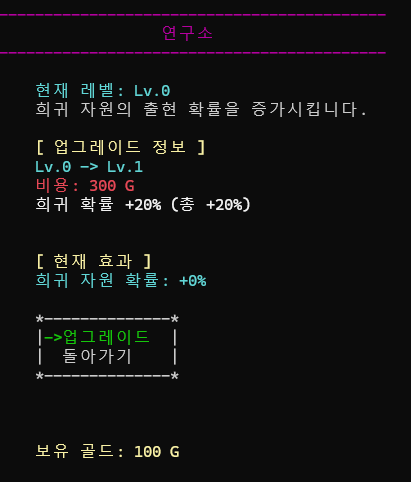

# 제갈도원 객체지향 콘솔게임

### 게임 이름 : 수집 제작 타운라이프 (초안)

### 컨셉
- 플레이어는 광부가 되어 광산에서 자원을 채굴 합니다.  
- 마을을 중심으로 광물을 판매하고 건물을 업그레이드 합니다.

### 루프
    마을 입장 -> 필드 입장 -> 자원 수집 -> 인벤토리가 가득 참 -> 마을 귀환 -> 상점 판매
    -> 건물 업그레이드 -> 필드 입장

### 시스템 
    상점 : 자원 판매, 장비 구매
    창고 : 인벤토리 용량 증가
    연구소 : 희귀자원 드랍 확률 증가
    필드 : 광물 수집
    자원 : 다이아, 금, 은, 동

 
---

### 조작 방법
    캐릭터 이동 :   방향키
    Space :        상호작용
    ESC :          뒤로가기
    L :            디버그 로그 보기

### 건물
    S : 상점 : 광물 판매
    W : 창고 : 인벤토리 용량 업그레이드
    L : 연구소 : 희귀 자원 확률 업그레이드
    M : 광산 : 광산 입장

### 화면 구성
### Main (초안)

---
## 구현
### MainScene

### StartScene

### Field

### Shop

### Warehouse

### Laboratory

